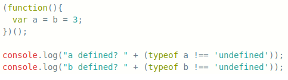
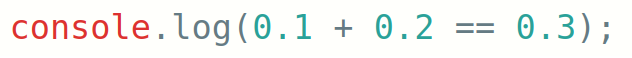
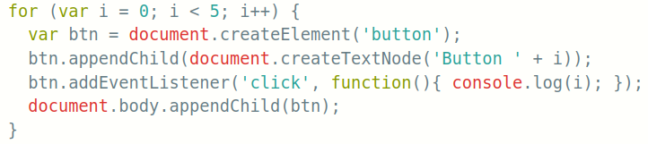
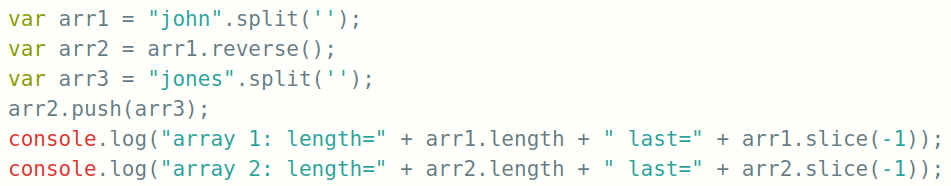
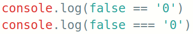
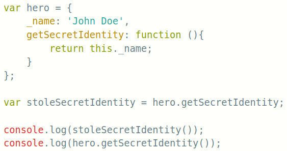

# Sesión 16 - 09/12/2021

En la sesión final resolvimos dudas que surgieron en los simulacros de entrevistas técnicas con los mentores. Con el siguiente kahoot iniciamos la conversación.

## Kahoot

[https://create.kahoot.it/details/b4d74e93-0c1f-4a9d-9203-6cb5fcbfb2cd](https://create.kahoot.it/share/kahoot-gimnasio/66c0c5ba-7862-46b0-979b-9ebac7682cce)

1. What will the code below output to the console and why?

   - [ ] a defined? false  / b defined? false
   - [x] a defined? false  / b defined? true
   - [ ] a defined? true  / b defined? true
   - [ ] a defined? true  / b defined? false

2. What will the code below output? Explain your answer.

   - [ ] True
   - [x] False

3. What gets logged to the console when the user clicks on “Button 4” and why?

   - [ ] 4
   - [ ] 3
   - [x] 5
   - [ ] undefined

4. What will the code below output to the console and why?

   - [ ] array 1: length=4 last=j,o,h,n / array 2: length=9 last=n,h,o,j
   - [ ] array 1: length=4 last=n / array 2: length=9 last=s
   - [ ] array 1: length=5 last=n / array 2: length=5 last=s
   - [x] array 1: length=5 last=j,o,n,e,s / array 2: length=5 last=j,o,n,e,s

5. What will be the output when the following code is executed? Explain.

   - [x] true/false
   - [ ] false/true
   - [ ] true/true
   - [ ] false/false

6. What will the following code output to the console and why:

   - [ ] John Doe  / John Doe
   - [ ] John Doe  / undefined
   - [x] undefined  / John Doe
   - [ ] undefined  / undefined
