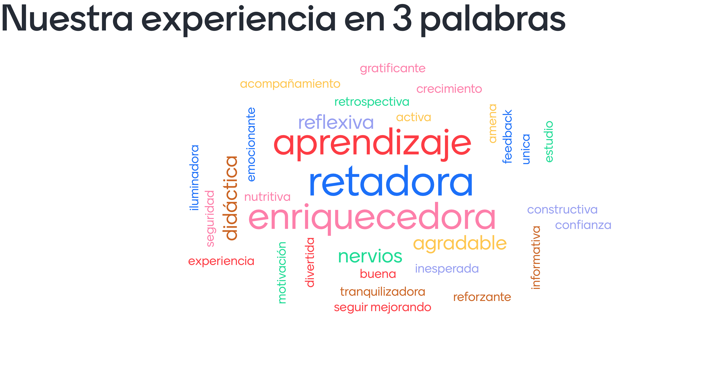

# Retrospective tech mock interviews - 02/06/2022

## 1) Compartimos nuestra experiencia [45 min]  breakout rooms

Nos dividiremos en 2 salas y cada estudiante comparte su experiencia y
aprendizajes en no mas de (2 min).

> La distribución de las salas la encontraras en el archivo `Bootcamp, MEX012 OH`
> en la pestañita `RETRO GYM`.

### Interacción

#### Breakout room 1

> - Moderadora: Dany Miñon
>
> - Documentadora: Liliana
>
> - Documento:
> >
> > - [https://docs.google.com/document/d/1TuHiR8h2vf_oMcGIknHNxGTZFDWljOvgKr40RA_4KmY/edit?usp=sharing](https://docs.google.com/document/d/1TuHiR8h2vf_oMcGIknHNxGTZFDWljOvgKr40RA_4KmY/edit?usp=sharing)
>
> - Coaches: Mariana Z, Gene, Daniel G

#### Breakout room 2

> - Moderadora: Meli
>
> - Documentadora: Skarlet
>
> - Documento:
> >
> > - [https://docs.google.com/document/d/1Li8epLKApRxWipy5rsTfx43a3_Q-3yxFQHWwJTrcr_E/edit?usp=sharing](https://docs.google.com/document/d/1Li8epLKApRxWipy5rsTfx43a3_Q-3yxFQHWwJTrcr_E/edit?usp=sharing)
>
> - Coaches: Nachi, Sebas, Carlos, Marcia

## 2) Compartiremos nuestra experiencia en 3 palabras [20min] breakout rooms

- Dejaremos 3 palabras que mas se relacionan con nuestra experiencia de entrevista
técnica.
- Conversaremos y reflexionamos sobre las palabras que más resuenan en el mentimeter.

## 3) Retrospectiva en FigJam [30 min] Sala general

> Llenamos nuestras notas en un tablero de FigJam con las siguientes columnas:
>
> - Que cosas hice bien?
> - Que cosas no hice bien?
> - Que `ACCIONABLES` implementare para mejorar?

Algunos de los puntos sobre los que podemos reflexionar, aunque no exclusivos, son:
planeación, estrategia, preparación, puntualidad, comunicación, análisis y
resolución de problemas, tech skills, soft skills, gimnasio, feedback, etc.

- [link de la retrospectiva](https://www.figma.com/file/pBLnOqbH1v5h6zcxiddTxY/Retrospectiva-de-entrevista-tecnica-MEX012?node-id=635%3A44)
