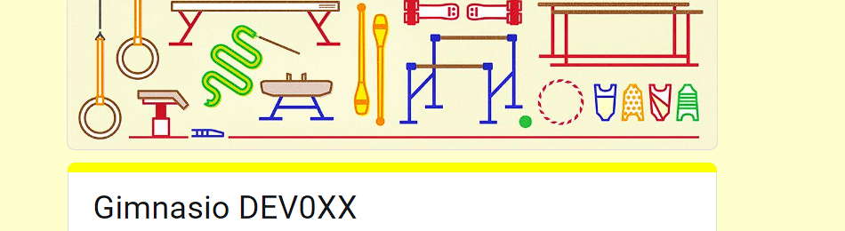

# Implementación de formulario de feedback y dashboard

Este documento proporciona instrucciones detalladas sobre la implementación del
formulario de feedback del gimnasio y su conexión con un dashboard en Looker Studio.
Cada cohorte debe crear su versión personalizada tanto del formulario como del
dashboard para facilitar la toma de decisiones basada en los datos recopilados.

## Objetivos

Los principales objetivos de esta dinámica de mock interview es:

- El objetivo del formulario de feedback es obtener información cuantitativa de la
ejecución de la instancia de gimnasio para asi poder hacer una revisión más
precisa de la ejecución del gimnasio.

- Con la data recolectada evaluar de forma periódica el desempeño de las
estudiantes a nivel individual.

- Tomar accionables de forma individiual o grupal, como cambiar el nivel de los
ejercicios planteados.

## **Formulario**

[Formulario del gym](https://docs.google.com/forms/d/17-zucrqVGubQkTsTSO9-wjhTyCYtkia1wPtEv_XhaU4/edit)
aquí encontrarás una plantilla del formulario, procede a cambiar el nombre
con el código de tu cohort.

## **Dashboard**

El reporte desarrollado en Looker Studio lo puedes encontrar [aquí](https://lookerstudio.google.com/s/qEFv2USLjKs)
Encontrarás un boton con tres puntos al hacer click encontrarás una opción de make
a copy,

Posteriormente en tu copia procede a cambiar el origen de datos del dashboard.

En caso de requerir detalles existe una
[guía](https://www.loom.com/share/ab4f137b7bf94db78e21a6c26694a54a)
detallando el proceso.

