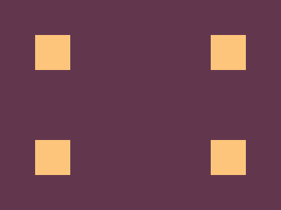

---
difficulty:
  - newbie
OAs:
  - css selectors
  - box layout
projects:
  - data lovers
  - social network
---

# CSS Carrom

[https://cssbattle.dev/play/2](https://cssbattle.dev/play/2)



__Objetivo__

Escriba el HTML/CSS en el editor para replicar la imagen objetivo de la derecha.

__Código de base__

```html
    <div></div>
    <style>
      div {
        width: 100px;
        height: 100px;
        background: #dd6b4d;
      }
    </style>
```
