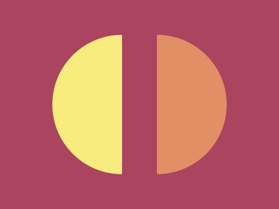

---
difficulty:
  - beginner
OAs:
  - css/boxmodel
---

# CSS Equals

[https://cssbattle.dev/play/31](https://cssbattle.dev/play/31)



**Objetivo**

Escreva o HTML/CSS no editor para replicar a imagem de destino à direita.

**Código base**

```html
<div></div>
<style>
  div {
    width: 100px;
    height: 100px;
    background: #dd6b4d;
  }
</style>
```
