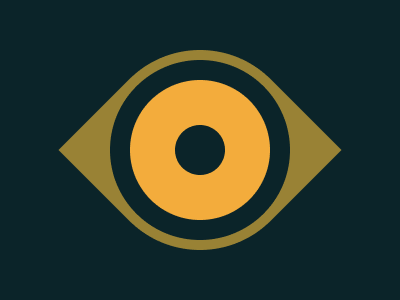

---
difficulty:
  - Intermediate
OAs:
  - css/position
---

# CSS Eye of the Tiger

[https://cssbattle.dev/play/16](https://cssbattle.dev/play/16)



__Alvo__

Escreva o HTML/CSS no editor para replicar a imagem de destino à direita.

__Código básico__

```html
    <div></div>
    <style>
      div {
        width: 100px;
        height: 100px;
        background: #dd6b4d;
      }
    </style>
```
