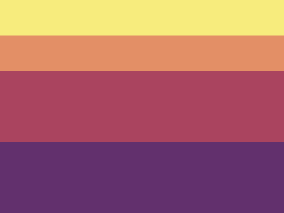

---
difficulty:
  - newbie
OAs:
  - css selectors
  - box model
  - css units
projects:
  - social network
  - data lovers
---

# CSS Horizon

[https://cssbattle.dev/play/30](https://cssbattle.dev/play/30)



__Objetivo__

Escreva o HTML/CSS no editor para replicar a imagem de destino à direita.

__Código base__

```html
    <div></div>
    <style>
      div {
        width: 100px;
        height: 100px;
        background: #dd6b4d;
      }
    </style>
```
