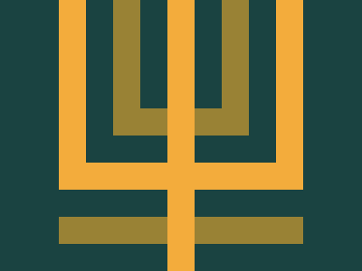

---
difficulty:
  - intermediate
OAs:
  - Pseudo-classes
  - margin
  - position
---

# CSS Magical Tree

[https://cssbattle.dev/play/45](https://cssbattle.dev/play/45)



__Objetivo__

Escriba el HTML/CSS en el editor para replicar la imagen objetivo de la derecha.

__Código de base__

```html
<div></div>
<style>
  div {
    width: 100px;
    height: 100px;
    background: #dd6b4d;
  }
</style>
```
