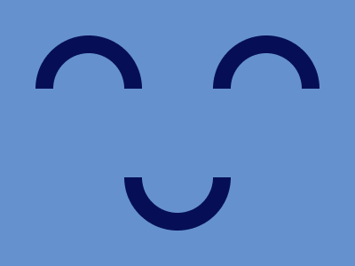

---
difficulty:
  - Beginner
OAs:
  - css selectors
  - box model
  - border radius
---

# CSS Smiley

[https://cssbattle.dev/play/26](https://cssbattle.dev/play/26)


__Objetivo__

Escriba el HTML/CSS en el editor para replicar la imagen objetivo de la derecha.

__Código de base__

```html
    <div></div>
    <style>
      div {
        width: 100px;
        height: 100px;
        background: #dd6b4d;
      }
    </style>
```

Tip: _border-radius_ recibe varios parámetros.