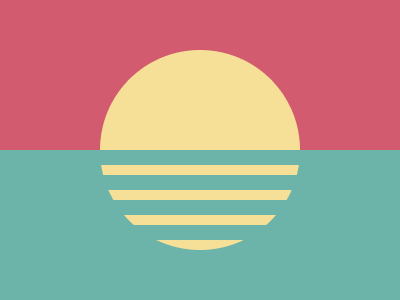

---
difficulty:
  - beginner
OAs:
  - css selectors, layout, border-radius
projects:
  - all
---

# CSS Sunset

[https://cssbattle.dev/play/91](https://cssbattle.dev/play/91)



__Objetivo__

Escreva o HTML/CSS no editor para replicar a imagem de destino à direita. 

__Código de base__

```html
    <div></div>
    <style>
      div {
        width: 100px;
        height: 100px;
        background: #dd6b4d;
      }
    </style>
```
