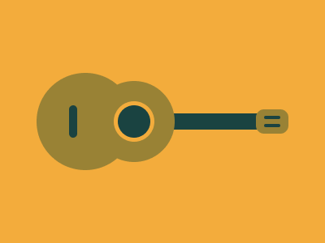

---
difficulty:
  - beginner
OAs:
  - css/box-model/flex
projects:
  - memory-match
  - social-network
---

# CSS Totally Triangle

[https://cssbattle.dev/play/78](https://cssbattle.dev/play/78)



__Objetivo__

Escriba el HTML/CSS en el editor para replicar la imagen objetivo de la derecha.

__Código de base__

```html
    <div></div>
    <style>
      div {
        width: 100px;
        height: 100px;
        background: #dd6b4d;
      }
    </style>
```
