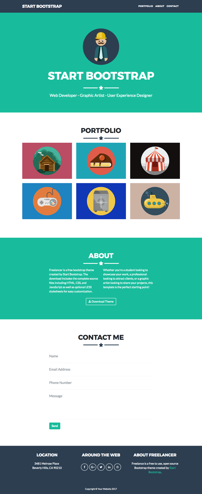

---
difficulty:
  - beginner
OAs:
  - HTML
  - CSS
projects:
  - labnotes
  - social network
---

# Freelancer

__Objetivo:__

El reto consiste en replicar el sitio de __Freelancer__, este será el resultado
a lograr:

Enfócate en obtener la maquetación
lo más parecido posible.

## Consideraciones

> - Iniciaras tu propio boilerplate para construir la estructura de tu proyecto y
enlazar tus archivos de estilos (CSS).
>
> - Dentro de la carpeta `assets` encontrarás todas
 las imágenes necesarias para completar tu proyecto.
>
> - Esta web utiliza 2 tipografías: `Montserrat` y `Lato`.
>
> - La paleta de colores es:
> >
> > - `#2c3e50`
> > - `#18bc9c`
> > - `#212529`
>
> - Los íconos de redes sociales puedes obtenerlos de [Font Awesome](http://fontawesome.io/).
>
> - El subrayado incluye la estrella en las diversas secciones del sitio y
es un reto entretenido, sin embargo, no trates de enfocarte en esa parte desde
un inicio ya que __no es el objetivo__ principal del reto :)

## A tener en cuenta

> - Trabaja colaborativamente en dupla o triada
>
> - Pixel perfect (replicar el diseño con exactitud)
