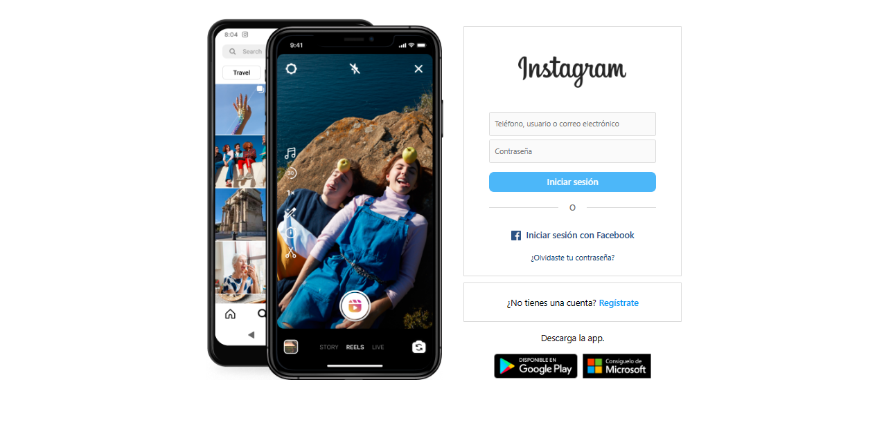

---
difficulty:
  - intermediate
OAs:
  - HTML
  - CSS
projects:
  - text analyzer
  - card validation
  - cipher
---

# Instagram login

__Objetivo:__

El reto consiste en replicar el __Login de Instagram__, este será el resultado:

Enfócate en obtener la maquetación
lo más parecido posible (sin funcionalidad).

> - Iniciaras tu propio boilerplate para construir la estructura de tu proyecto y
enlazar tus archivos de estilos (CSS).
>
> - Dentro de la carpeta `assets` encontrarás todas
 las imágenes necesarias para completar tu proyecto.
>
> - Esta web utiliza `font-family: -apple-system, BlinkMacSystemFont,
"Segoe UI", Roboto, Helvetica, Arial,
sans-serif`.
>
> - La paleta de colores es:
> >
> > - Fondo : `#FFFFFF`
> > - Facebook : `#385185`
> > - Botón : `#70B5F9`
>
## A tener en cuenta

> - Pixel perfect (replicar el diseño con exactitud)
>
