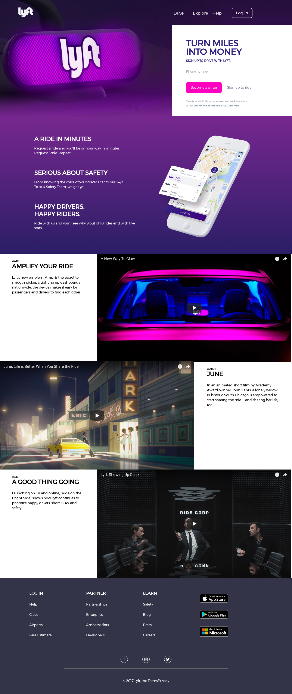

---
difficulty:
  - intermediate
OAs:
  - HTML
  - CSS
projects:
  - labnotes
  - social network
---

# Lyft

__Objetivo:__

El reto consiste en replicar el sitio de __Lyft__, este será el resultado
a lograr:

Enfócate en obtener la maquetación
lo más parecido posible.

## Consideraciones

> - Iniciaras tu propio boilerplate para construir la estructura de
tu proyecto y enlazar tus archivos de estilos (CSS).
>
> - Dentro de la carpeta `assets` encontrarás todas
 las imágenes necesarias para completar tu proyecto.
>
> - Esta web utiliza la tipografía `ProximaNova, sans-serif`.
>
> - La paleta de colores es:
> >
> > - Botones, hover: `#523BE4`
> > - Fondo: `#F4F4F4`, `#FFFFFF` y `#DCDCFF`
> > - Gradiente footer: `linear-gradient( to bottom, #e7e7ef 0%,
 #f4f4fa 5%, #ffffff 10% );`
>
> - Además, encontraras los íconos en la carpeta `assets/icons`.
>
> - Puedes ver el [sitio original](https://www.lyft.com/), sin embargo, su diseño
cambia constantemente,
así que tu fuente de verdad es la imagen que
muestra el objetivo de este reto.

## A tener en cuenta

> - Trabaja colaborativamente en dupla o triada
>
> - Pixel perfect (replicar el diseño con exactitud)
