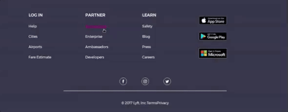

---
difficulty:
  - intermediate
OAs:
  - HTML
  - CSS
projects:
  - labnotes
  - social network
---

# Lyft

__Objetivo:__

O desafio é replicar o site __Lyft__, esse será o resultado
alcançar:

Concentre-se em obter o layout
o mais parecido possível.

## Considerações

> - Você iniciará seu próprio clichê para construir a estrutura do seu projeto e
vincule seus arquivos de estilo (CSS).
>
> - Dentro da pasta `assets` você encontrará todos
 as imagens necessárias para completar seu projeto.
>
> - Este site usa a fonte `Montserrat`.
>
> - A paleta de cores é:
> >
> > - Botões, hover: `#FF00BF`
> > - Parte inferior de `footer`: `#333447`
> > - Título do formulário: `#352384`
> > - Texto do formulário: `#728099`
> > - Gradiente roxo: `linear-gradient(#76278F, #2B1E66);`
>
> - Para o rodapé, você deve levar em consideração que
ele tem um foco e se parece com o
seguinte imagem:
> 
>
> - Além disso, você encontrará os ícones na pasta `assets/icons`.
>
> - Estes são os vídeos do YouTube:
> >
> > - https://www.youtube.com/watch?v=fLSmUWOYpKw
> > - https://www.youtube.com/watch?v=V7j8Aqxmbs8
> > - https://youtu.be/Z77bvaf7mCQ
>
> - Você pode ver o [site original](https://www.lyft.com/), porém seu design
muita coisa já mudou
então sua fonte de verdade é a imagem que
mostra o objetivo deste desafio.

## Considerar

> - Trabalhe colaborativamente em pares ou tríades
>
> - Pixel perfeito (replica exatamente o design)
