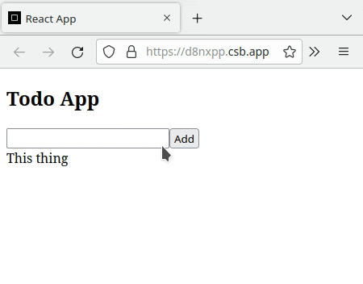

---
difficulty:
  - intermediate
OAs:
  - jsx
  - components
  - events
  - lists-and-keys
  - conditional-rendering
  - hooks
projects:
  - data-lovers
  - memory-match
---

# React challenge 1

En este
[codesandbox](https://codesandbox.io/s/react-challenge-1-exercise-16zvut)
encontrarás un *boilerplate* de una *todo app*.

Deberás completar el código para que la funcionalidad final sea como la que se
muestra en la siguiente animación:

## Pistas

1. Lee el código y entiende cúal es la responsabilidad de cada componente.
2. En el componente *ToDoApp*, ¿qué estado almacena el listado de todos?
¿qué prop pasarias al componente *AddToDo* para que pueda agregar items
al listado?
3. En el componente *AddToDo*, ¿cómo implementarías la función
*addToDoAction* para que agregue el parámetro *newItem* al estado
*todoList* del padre?
4. En el componente *ToDoList* ¿cómo implementarías la función
*updateToDoState* ? Te sugerimos que esta función:

    1. Encuentre en el prop *list* el item identificado
    con el *id* entregado como parámetro
    2. Del item encontrado actualice la llave *done*
    3. Actualice estado *todoList* del padre
