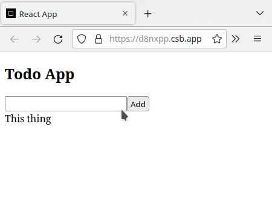

---
difficulty:
  - intermediate
OAs:
  - jsx
  - components
  - events
  - lists-and-keys
  - conditional-rendering
  - hooks
projects:
  - data-lovers
  - memory-match
---

# React challenge 1

Nesta
[codesandbox](https://codesandbox.io/s/react-challenge-1-exercise-16zvut)
você encontrará uma *boilerplate* de um *todo app*.

Você precisará completar o código para que a funcionalidade final se pareça
com a mostrada na animação abaixo:

## Dicas

1. Leia o código e entenda qual é a responsabilidade de cada componente.
2. No componente *ToDoApp*, em que estado a todoList armazena? Que adereço
você passaria para o componente *AddToDo* para que ele possa adicionar
itens à todoList?
3. No componente *AddToDo*, como você implementaria a função
*addToDoAction* para que ela acrescente o parâmetro *newItem* ao estado
todoList dos pais?
4. No componente *ToDoList*, como você implementaria a função
*UpdateToDoState*? Sugerimos que esta função:

    1. Encontre na prop *list* o item identificado com o *id* dado como
parâmetro.
    2. A partir do item encontrado, atualize a chave *done*
    3. Atualizar o estado de todas as listas dos pais
