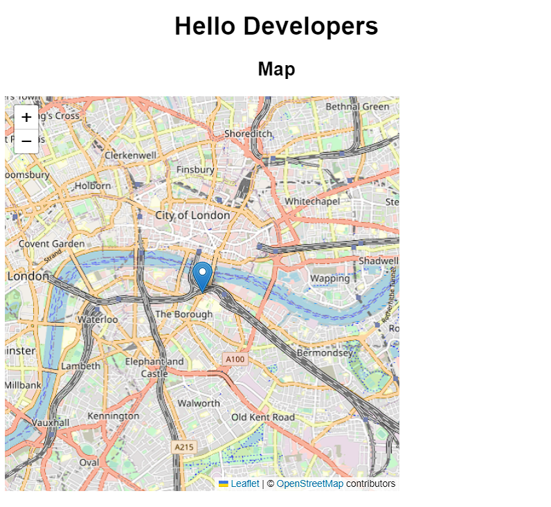

---
difficulty:
  - intermediate
OAs:
  - html
  - css
projects:
  - burguer-queen-api-client
---

# React Fix map

En este
[codesandbox](https://codesandbox.io/p/sandbox/fix-map1-6ljfqd?file=%2Fsrc%2FApp.js%3A12%2C1)
encontrarás un *boilerplate* con React y usa la libreria Leaflet para mostrar un Mapa.

La aplicación tiene un error donde el Mapa se ve incorrectamente.

La aplicación debe verse de esta manera ya con el Mapa solucionado, donde se muestra correctamente con controles.

## Pistas

1. Lee el código y entiende que puede estar afectando al error.
2. El componente es Mapview.js pero no necesariamente la solución esta ahí
3. Es un problema de apariencia que puede estar faltando
4. Puedes revisar la documentación de Leaflet [aquí](https://leafletjs.com/)
