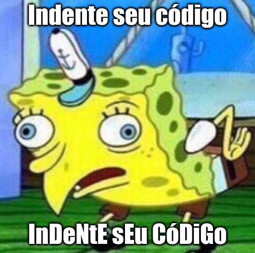

---
difficulty:
  - beginner
OAs:
  - string manipulation
  - loops
projects:
  - cipher
  - card-validation
---

# sPoNgEbOb MeMe



[https://www.codewars.com/kata/5982619d2671576e90000017/train/javascript](https://www.codewars.com/kata/5982619d2671576e90000017/train/javascript)

Lembra-se do meme do Bob Esponja que pretende tirar sarro das pessoas repetindo
o que elas dizem de forma zombeteira?

Você precisa criar uma função que converta a entrada para este formato, com a
saída sendo a mesma string, exceto que há um padrão de letras maiúsculas e
minúsculas.

**Exemplos:**

```javascript
spongeMeme('stop Making spongebob Memes!'); // => 'StOp mAkInG SpOnGeBoB MeMeS!'
spongeMeme('colored teens cant Be successful in tech'); // =>'CoLoReD TeEnS CaNt bE SuCcEsSfUl iN TeCh'
```
