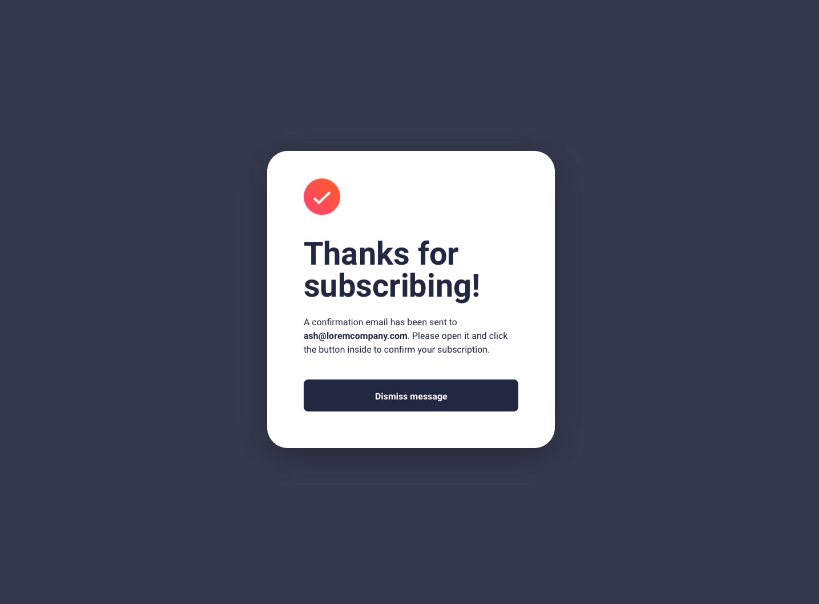

---
difficulty:
  - newbie
OAs:
  - HTML
  - CSS
projects:
  - text analyzer
  - card validation
  - cipher
---

# Subscribing

__Objetivo:__

El reto consiste en replicar la siguiente __ventana__, este será el resultado:

Enfócate en obtener la maquetación
lo más parecido posible (sin funcionalidad).

> - Iniciaras tu propio boilerplate para construir la estructura de tu proyecto y
enlazar tus archivos de estilos (CSS).
>
> - Dentro de la carpeta `assets` encontrarás todas
 las imágenes necesarias para completar tu proyecto.
>
> - Esta web utiliza la tipografía `Roboto`.
>
> - La paleta de colores es:
> >
> > - Fondo : `#36384D` y `#FFFFFF`
> > - Texto : `#23283d`
> > - Botón : `#272742`
>

## A tener en cuenta

> - Pixel perfect (replicar el diseño con exactitud)
>
> - Ten presente el [modelo de caja](https://curriculum.laboratoria.la/es/topics/css/css/boxmodel-and-display)
