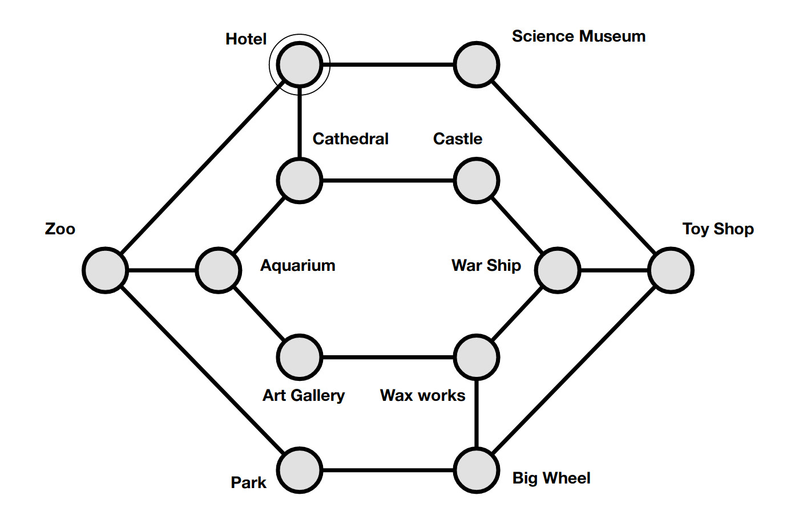

# Guia turística

[Booklet CS4FN Issue 1 - Desafio 15 - Página 13](https://cs4fndownloads.files.wordpress.com/2016/02/cs4fnpuzzlebook11.pdf#page=8)

Você é uma guia turística de um hotel. Os turistas hospedados em seu hotel
esperam ser levados em um passeio visitando todas as atrações da cidade.

Você recebeu um mapa subterrâneo que mostra todos os locais das atrações e como
você pode ir de uma a outra usando a rede subterrânea. Você deve elaborar uma
rota que comece no hotel e leve seu grupo de excursão a todos os locais
turísticos. Os turistas ficarão descontentes se passarem pelo mesmo lugar duas
vezes. Eles também querem acabar de volta ao hotel naquela noite.

## Objetivos de aprendizagem (OAs)

- Pensamento computacional
