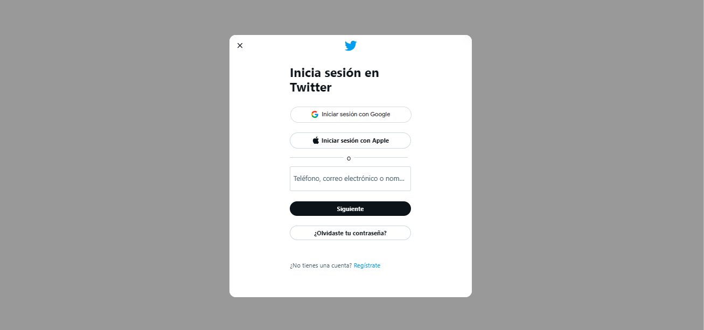

---
difficulty:
  - beginner
OAs:
  - HTML
  - CSS
projects:
  - text analyzer
  - card validation
  - cipher
---
# Twitter login

__Objetivo:__

El reto consiste en replicar el __login de Twitter__, este será el resultado
a lograr:

Enfócate en obtener la maquetación
lo más parecido posible (sin funcionalidad).

## Consideraciones

> - Iniciaras tu propio boilerplate para construir la estructura de tu proyecto y
enlazar tus archivos de estilos (CSS).
>
> - Dentro de la carpeta `assets` encontrarás todas
 las imágenes necesarias para completar tu proyecto.
>
> - Esta web utiliza `font-family: -apple-system, BlinkMacSystemFont,
"Segoe UI", Roboto, Helvetica, Arial,
sans-serif`.
>
> - La paleta de colores es:
> >
> > - `#0F1419`
> > - `#999999`
> > - `#4F9CF0`
>

## A tener en cuenta

> - Trabaja individualmente
>
> - Pixel perfect (replicar el diseño con exactitud)
>
> - Ten presente el [modelo de caja](https://curriculum.laboratoria.la/es/topics/css/css/boxmodel-and-display)
